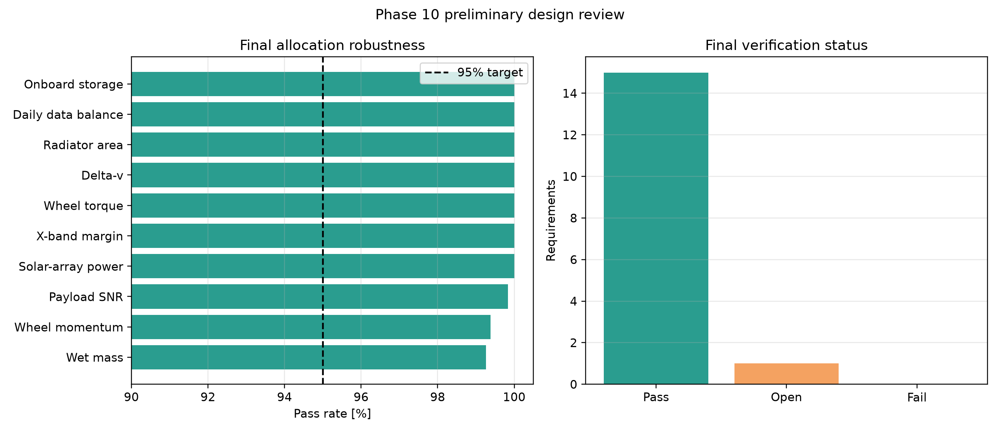
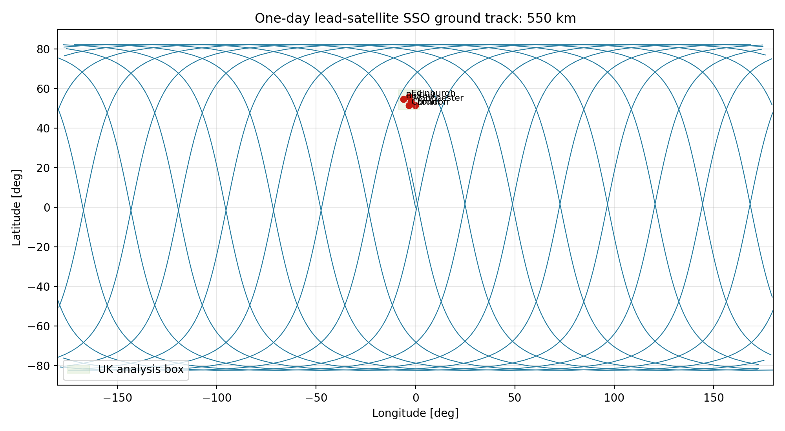
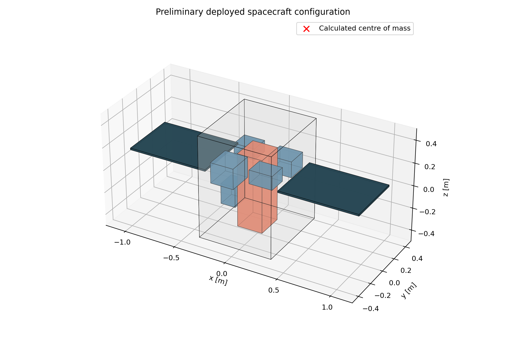
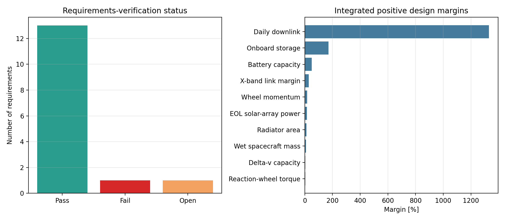
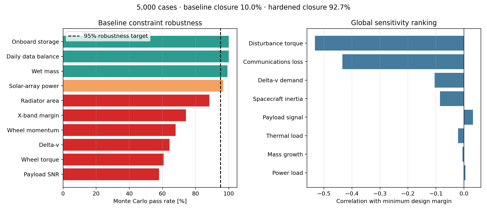

# Earth-Observation Satellite Mission & Systems Design


[](https://github.com/mathonwyaj/Earth-Observation-Satellite-Mission-Design/actions/workflows/tests.yml)


An end-to-end preliminary systems design for a two-spacecraft multispectral
Earth-observation mission supporting UK flood monitoring. The project links
payload sizing and radiometry to orbit selection, coverage, mission operations,
spacecraft subsystem budgets, configuration, requirements verification and
Monte Carlo robustness analysis.

> This is a concept-level engineering portfolio study, not a flight-qualified
> spacecraft design. Performance values are model outputs based on the stated
> assumptions and simplifications.

## Selected mission concept

| Parameter | Selected design |
|---|---:|
| Architecture | 2 spacecraft |
| Orbit | 550 km sun-synchronous orbit |
| Inclination | 97.593 deg |
| Ground-sampling distance | 10 m |
| Swath width | 81.92 km |
| Representative UK-site maximum revisit | 37.79 h |
| Modelled worst priority-delivery latency | 1.39 h |
| Spacecraft wet-mass limit | 60 kg each |
| Payload aperture | 190 mm |
| Multispectral bands | Blue, green, red and NIR |

The final 5,000-case Monte Carlo assessment achieved **98.48% simultaneous
budget closure**, exceeding the 95% concept target. The final verification
matrix contains **15 passed, 1 open and 0 failed** concept-level requirements.
The open item is three-year mission-life verification.



## Engineering workflow

```text
Mission requirements
        |
Payload sizing and radiometry
        |
Payload optimisation
        |
Orbit and coverage
        |
Mission operations and ground segment
        |
Spacecraft subsystem sizing
        |
Integrated budgets and requirements
        |
Spacecraft configuration
        |
Monte Carlo robustness
        |
Final preliminary design review
```

## Repository contents

| Area | Main script | Key outputs |
|---|---|---|
| Payload geometry | `payload_sizing.py` | Focal length, detector and swath trades |
| Radiometry | `payload_radiometry.py` | Band SNR and data-rate estimates |
| Payload optimisation | `payload_optimisation.py` | Aperture/exposure trade and preferred payload |
| Orbit and coverage | `orbit_coverage.py` | SSO design, ground tracks and UK revisit trade |
| Mission operations | `mission_operations.py` | Contacts, downlink capacity, storage and latency |
| Spacecraft subsystems | `spacecraft_subsystems.py` | Mass, power, link, ADCS, propulsion and thermal sizing |
| Integrated baseline | `integrated_budgets.py` | System margins and requirements matrix |
| Configuration | `spacecraft_configuration.py` | Layout, centre of mass, drawings and STL concept |
| Robustness | `monte_carlo_robustness.py` | 5,000-case Monte Carlo and sensitivity analysis |
| Final review | `final_design_review.py` | Selected design, final matrix and review report |

The complete preliminary design review is available here:
[`Earth_Observation_Satellite_Preliminary_Design_Review.pdf`](results/final_design_review/Earth_Observation_Satellite_Preliminary_Design_Review.pdf).

## Example engineering outputs

| Orbit and coverage | Spacecraft configuration |
|---|---|
|  |  |

| Integrated budgets | Robustness and sensitivity |
|---|---|
|  |  |

## Installation

Python 3.12 was used for the completed study.

```bash
git clone https://github.com/mathonwyaj/Earth-Observation-Satellite-Mission-Design.git
cd Earth-Observation-Satellite-Mission-Design
python -m venv .venv
```

Activate the environment on Windows PowerShell:

```powershell
.\.venv\Scripts\Activate.ps1
python -m pip install -r requirements.txt
```

On macOS or Linux:

```bash
source .venv/bin/activate
python -m pip install -r requirements.txt
```

## Run the analysis

Each script writes its numerical results and figures to the corresponding
folder under `results/`.

```bash
python payload_sizing.py
python payload_radiometry.py
python payload_optimisation.py
python orbit_coverage.py
python mission_operations.py
python spacecraft_subsystems.py
python integrated_budgets.py
python spacecraft_configuration.py
python monte_carlo_robustness.py
python final_design_review.py
```

## Verification

Run the complete automated test suite with:

```bash
python -m unittest discover -v
```

The final baseline contains **61 automated tests** covering physical output
checks, trade-study behaviour, subsystem closure, configuration geometry,
requirements integration and final-review consistency.

## Requirements and assumptions

The principal concept requirements include:

- 10 m or better nadir ground-sampling distance
- At least 50 km swath width
- 450-650 km orbit-altitude trade range
- Blue, green, red and near-infrared imaging bands
- Image-motion smear no greater than 0.5 pixel during exposure
- 60 kg wet-mass limit per spacecraft
- 95% simultaneous budget-closure target under the selected uncertainties

The models use analytical or reduced-order representations suitable for early
trade studies. Important assumptions include representative UK sites rather
than a complete area-coverage mask, idealised orbit and ground-station
availability, assumed optical and detector properties, preliminary component
allocations and simplified environmental models.

## Limitations and future verification

The study does not claim flight qualification or validated vendor performance.
Further work would include:

- high-fidelity optical design and detector selection
- higher-fidelity orbit propagation and complete area-coverage analysis
- licensed ground-service and detailed RF link validation
- component-level thermal, structural and radiation analysis
- hardware selection, procurement and accommodation verification
- reliability and lifetime analysis for the three-year mission requirement
- hardware-in-the-loop or flight-like software verification

## Tools

- Python 3.12
- NumPy
- Matplotlib
- python-docx
- `unittest`

## Author

**Mathonwy Akiwumi-Jones**  
[GitHub](https://github.com/mathonwyaj) | [LinkedIn](https://www.linkedin.com/in/mathonwy-akiwumi-jones-342910374/)
